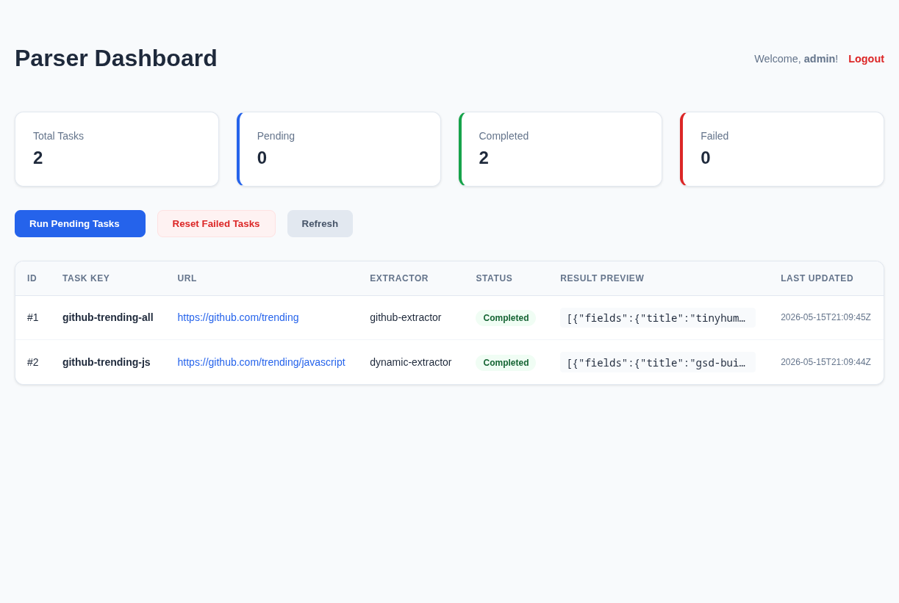
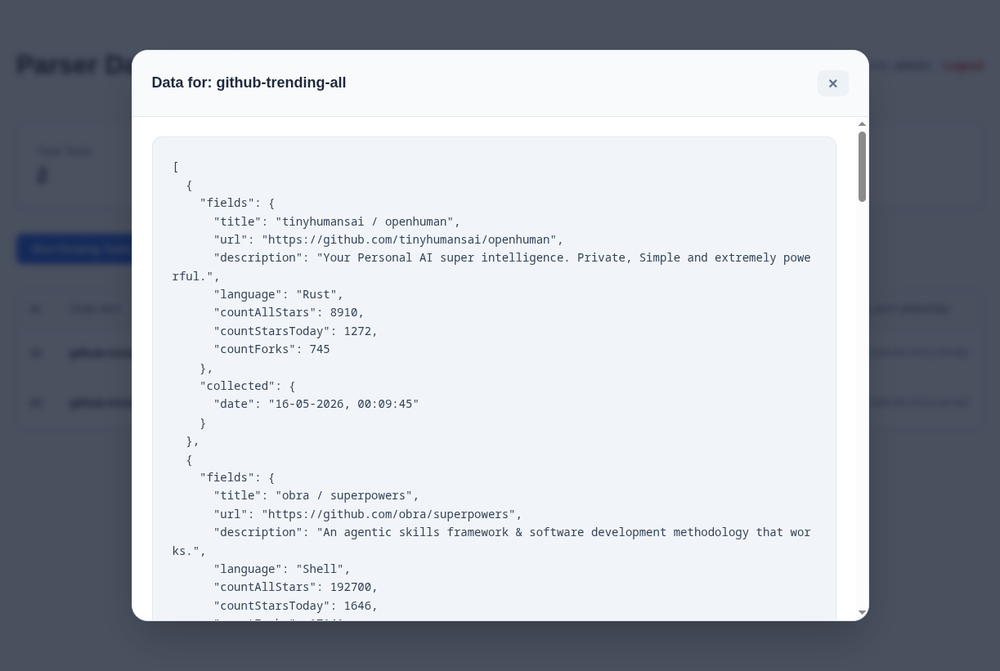

# Simple Parser

A modular web scraper framework using **Node.js**, **TypeScript**, **Playwright**, and **Golang**.
This project uses a hybrid architecture: Node.js handles browser automation, while Go manages the orchestration, task queue, and providing a web-based dashboard.

---

## Dashboard Preview

| Dashboard Overview | Data Modal (Light Theme) |
|:---:|:---:|
|  |  |

---

## Architecture

- **Go Backend (`services/backend`)**:
  - **Orchestrator**: Manages task distribution and state.
  - **Dashboard**: HTMX-powered web interface for monitoring and control.
  - **Database**: SQLite for persistent storage of tasks and results.
- **Node.js Worker (`services/worker`)**:
  - Stateless service running Playwright to perform actual web scraping.
  - Supports static and dynamic (schema-based) extraction.

---

## Quick Start (Podman / Docker)

The easiest way to run the project is using **Podman Compose** or **Docker Compose**:

```bash
# Start all services
podman-compose up -d --build
```

- **Dashboard**: `http://localhost:8080`
- **Worker API**: `http://localhost:3000`

---

## Manual Installation

1. **Worker Setup:**
```bash
cd services/worker
npm install
npx playwright install
npm start
```

2. **Backend Setup:**
```bash
cd services/backend
go mod download
# Run Dashboard
go run ./cmd/dashboard
# Run Orchestrator
go run ./cmd/orchestrator
```

---

## Configuration (`configs/tasks.json`)

Define your scraping tasks in `configs/tasks.json`:

```json
[
  {
    "name": "github-trending",
    "extractor": "github-extractor",
    "urls": ["https://github.com/trending"]
  },
  {
    "name": "custom-scrape",
    "extractor": "dynamic-extractor",
    "urls": ["https://example.com"],
    "schema": {
      "waitSelector": ".item",
      "fields": {
        "title": "h1",
        "description": ".desc"
      }
    }
  }
]
```

---

## Key Features

- **Hybrid Concurrency**: Go goroutines for task scheduling + Node.js Playwright for rendering.
- **Anti-Bot Evasion**: Integrated stealth plugins and browser fingerprinting protection.
- **HTMX Dashboard**: Real-time metrics and task management without complex frontend frameworks.
- **Dynamic Scraper**: Extract data from any site using JSON selectors without writing code.
